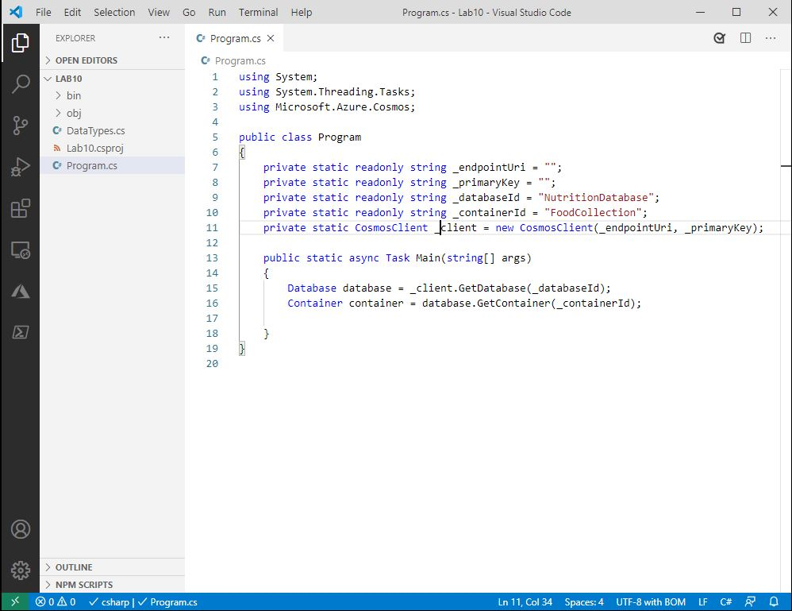
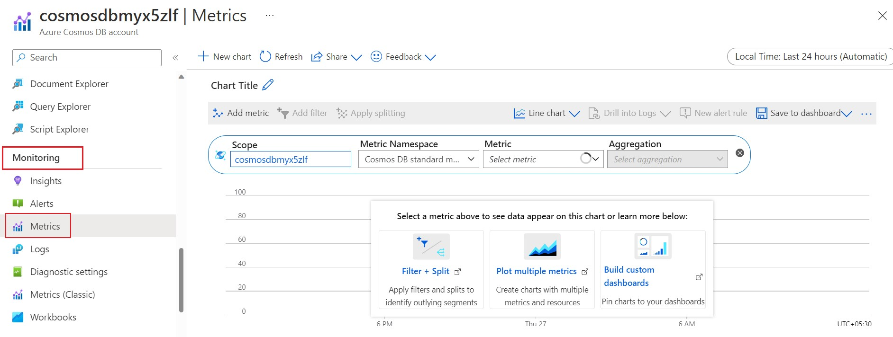
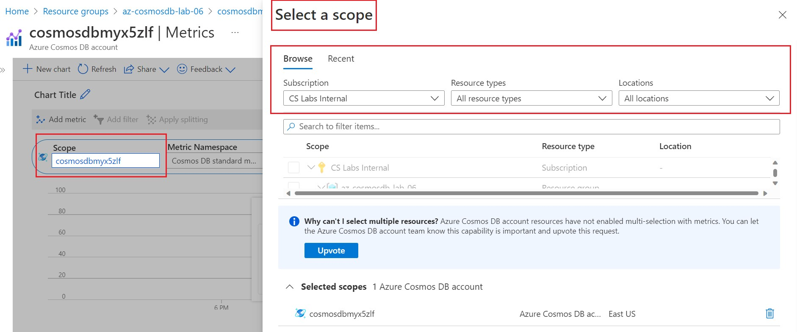
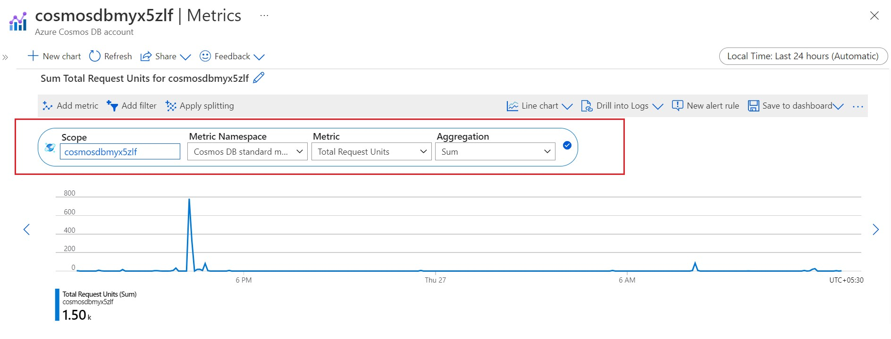
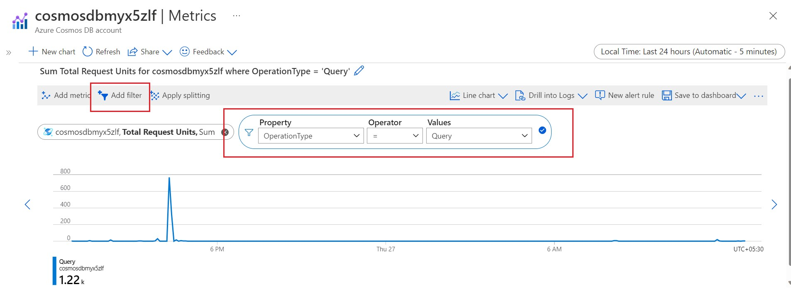
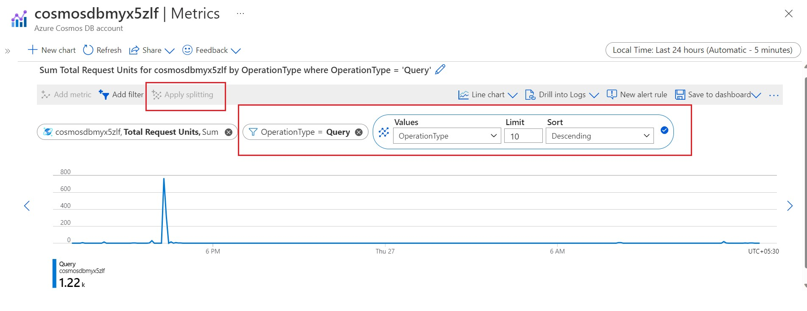

# Optimistic Concurrency Control

## Viewing the ETag Property of a Requested Resource

The SQL API supports optimistic concurrency control (OCC) through HTTP entity tags, or ETags. Every SQL API resource has an ETag, and the ETag is set on the server every time an item is updated. In this exercise, we will view the ETag property of a resource that is requested using the SDK.

### Recommended Prerequisites 

- [Transactions and optimistic concurrency control ](https://learn.microsoft.com/en-us/azure/cosmos-db/sql/database-transactions-optimistic-concurrency) 

### Create a .NET Core Project

1. Create **Lab10** folder that will be used to contain the content of your .NET Core project.

1. In the `Lab10` folder, right-click the folder and select the **Open with Code** menu option.

   > Alternatively, you can run a terminal in your current directory and execute the `code .` command.

1. In the Visual Studio Code window that appears, right-click the **Explorer** pane and select the **Open in Terminal** menu option.

1. In the open terminal pane, enter and execute the following command:

    ```sh
    dotnet new console
    ```

    > This command will create a new .NET Core project. The project will be a **console** project. 

1. Visual Studio Code will most likely prompt you to install various extensions related to **.NET Core** or **Azure Cosmos DB** development. None of these extensions are required to complete the labs.

1. In the terminal pane, enter and execute the following command:

    ```sh
    dotnet add package Microsoft.Azure.Cosmos --version 3.12.0
    ```

    > This command will add the [Microsoft.Azure.Cosmos](https://www.nuget.org/packages/Microsoft.Azure.Cosmos/) NuGet package as a project dependency. The lab instructions have been tested using the `3.12.0` version of this NuGet package.

1. In the terminal pane, enter and execute the following command:

    ```sh
    dotnet add package Bogus --version 30.0.2
    ```

    > This command will add the [Bogus](./assets/https://www.nuget.org/packages/Bogus/) NuGet package as a project dependency. This library will allow us to quickly generate test data using a fluent syntax and minimal code. We will use this library to generate test documents to upload to our Azure Cosmos DB instance. The lab instructions have been tested using the `30.0.2` version of this NuGet package.

1. In the terminal pane, enter and execute the following command:

    ```sh
    dotnet restore
    ```

    > This command will restore all packages specified as dependencies in the project.

1. In the terminal pane, enter and execute the following command:

    ```sh
    dotnet build
    ```

    > This command will build the project.


1. In the **Explorer** pane verify that you have a **DataTypes.cs** file in your project folder. This file contains the data classes you will be working with in the following steps.

1. Select the **Program.cs** link in the **Explorer** pane to open the file in the editor.

   

 1. Within the Program.cs editor tab, Add the following using blocks to the top of the editor:

    ```sh
      using System;
      using System.Collections.Generic;
      using System.Threading.Tasks;
      using Microsoft.Azure.Cosmos;
    ```
1. Within the Program class, add the following lines of code which creates variables for your connection information and Cosmos client. Database and Container info has to be added. Also **main()** method structure has to be added as given below.
   
   ```sh
    public class Program
   {
         private static readonly string _endpointUri = "<your uri>";
         private static readonly string _primaryKey = "<your key>";
         private static readonly string _databaseId = "NutritionDatabase";
         private static readonly string _containerId = "FoodCollection";
         private static CosmosClient _client = new CosmosClient(_endpointUri, _primaryKey);

    public static async Task Main(string[] args)
      {

      }
    }
    ```

1. For the `_endpointUri` variable, replace the placeholder value with the **URI** value and for the `_primaryKey` variable, replace the placeholder value with the **PRIMARY KEY** value from your Azure Cosmos DB account. Use [these instructions](https://github.com/CSALabsAutomation/azure-cosmosdb-lab/blob/main/steps/01_creating-a-partitioned-container/documentation.md) to get these values if you do not already have them:

   - For example, if your **uri** is `https://cosmosacct.documents.azure.com:443/`, your new variable assignment will look like this: 

    ```csharp
    private static readonly string _endpointUri = "https://cosmosacct.documents.azure.com:443/";
    ````

   - For example, if your **primary key** is `elzirrKCnXlacvh1CRAnQdYVbVLspmYHQyYrhx0PltHi8wn5lHVHFnd1Xm3ad5cn4TUcH4U0MSeHsVykkFPHpQ==`, your new variable assignment will look like this:

   ```csharp
   private static readonly string _primaryKey = "elzirrKCnXlacvh1CRAnQdYVbVLspmYHQyYrhx0PltHi8wn5lHVHFnd1Xm3ad5cn4TUcH4U0MSeHsVykkFPHpQ==";
   ```

1. Save all of your open editor tabs.

1. In the open terminal pane, enter and execute the following command:

   ```sh
   dotnet build
   ```

### Observe the ETag Property

1. Select the **Program.cs** link in the **Explorer** pane to open the file in the editor.

1. Locate the `Main()` method and add these lines:

   ```csharp
   public static async Task Main(string[] args)
    {
        Database database = _client.GetDatabase(_databaseId);
        Container container = database.GetContainer(_containerId);

    }
   ```

1. Add the following code to asynchronously read a single item from the container, identified by its partition key and id:

   ```csharp
   ItemResponse<Food> response = await container.ReadItemAsync<Food>("21083", new PartitionKey("Fast Foods"));
   ```

1. Add the following line of code to show the current ETag value of the item:

   ```csharp
   await Console.Out.WriteLineAsync($"ETag: {response.ETag}");
   ```

   > The ETag header and the current value are included in all response messages.

1. Save all of your open editor tabs.

1. In the open terminal pane, enter and execute the following command:

   ```sh
   dotnet run
   ```

1. Observe the output of the console application.

   > The ETag should remain unchanged since the item has not been changed.

1. Within the `Main` method, locate the following line of code:

   ```csharp
   await Console.Out.WriteLineAsync($"ETag:\t{response.ETag}");
   ```

   Replace that line of code with the following code:

   ```csharp
   await Console.Out.WriteLineAsync($"Existing ETag:\t{response.ETag}");
   ```

1. Next, add a new line of code to create an **ItemRequestOptions** instance that will use the **ETag** from the item and specify an **If-Match** header:

   ```csharp
   ItemRequestOptions requestOptions = new ItemRequestOptions { IfMatchEtag = response.ETag };
   ```

1. Add a new line of code to update a property of the retrieved item:

   ```csharp
   response.Resource.tags.Add(new Tag { name = "Demo" });
   ```

   > This line of code will modify a property of the item. Here we are modifying the **tags** collection property by adding a new **Tag** object.

1. Add a new line of code to invoke the **UpsertItemAsync** method passing in both the item and the options:

   ```csharp
   response = await container.UpsertItemAsync(response.Resource, requestOptions: requestOptions);
   ```

1. Add a new line of code to print out the **ETag** of the newly updated item:

   ```csharp
   await Console.Out.WriteLineAsync($"New ETag:\t{response.ETag}");
   ```

1. Your `Main` method should now look like this:

   ```csharp
   public static async Task Main(string[] args)
   {
      Database database = _client.GetDatabase(_databaseId);
      Container container = database.GetContainer(_containerId);

      ItemResponse<Food> response = await container.ReadItemAsync<Food>("21083", new PartitionKey("Fast Foods"));
      await Console.Out.WriteLineAsync($"Existing ETag:\t{response.ETag}");

      ItemRequestOptions requestOptions = new ItemRequestOptions { IfMatchEtag = response.ETag };
      response.Resource.tags.Add(new Tag { name = "Demo" });

      response = await container.UpsertItemAsync(response.Resource, requestOptions: requestOptions);
      await Console.Out.WriteLineAsync($"New ETag:\t{response.ETag}");

   }
   ```

1. Save all of your open editor tabs.

1. In the open terminal pane, enter and execute the following command:

   ```sh
   dotnet run
   ```

1. Observe the output of the console application.

   > You should see that the value of the ETag property has changed. The **ItemRequestOptions** class helped us implement optimistic concurrency by specifying that we wanted the SDK to use the If-Match header to allow the server to decide whether a resource should be updated. The If-Match value is the ETag value to be checked against. If the ETag value matches the server ETag value, the resource is updated. If the ETag is no longer current, the server rejects the operation with an "HTTP 412 Precondition failure" response code. The client then re-fetches the resource to acquire the current ETag value for the resource.

1. Back in the `Main` method, add a new line of code to again update a property of the item:

   ```csharp
   response.Resource.tags.Add(new Tag { name = "Failure" });
   ```

1. Add a new line of code to again invoke the **UpsertItemAsync** method passing in both the updated item and the same options as before:

   ```csharp
   response = await container.UpsertItemAsync(response.Resource, requestOptions: requestOptions);
   ```

   > The **ItemRequestOptions** instance has not been updated, so is still using the ETag value from the original object, which is now out of date so we should expect to now get an error.

1. Add error handling to the **UpsertItemAsync** call you just added by wrapping it with a try-catch and then output the resulting error message. The code should now look like this:

   ```csharp
   try
   {
      response = await container.UpsertItemAsync(response.Resource, requestOptions: requestOptions);
   }
   catch (Exception ex)
   {
      await Console.Out.WriteLineAsync($"Update error:\t{ex.Message}");
   }
   ```

1. Save all of your open editor tabs.

1. At end of this point, your Program.cs file should look like this:

```csharp
using System;
using System.Collections.Generic;
using System.Threading.Tasks;
using Microsoft.Azure.Cosmos;

public class Program
{
    private static readonly string _endpointUri = "<your-endpoint-url>";
    private static readonly string _primaryKey = "<your-primary-key>";
    private static readonly string _databaseId = "NutritionDatabase";
    private static readonly string _containerId = "FoodCollection";
    private static CosmosClient _client = new CosmosClient(_endpointUri, _primaryKey);
    public static async Task Main(string[] args)
    {
       
            var database = _client.GetDatabase(_databaseId);
            var container = database.GetContainer(_containerId);

            ItemResponse<Food> response = await container.ReadItemAsync<Food>("21083", new PartitionKey("Fast Foods"));
            await Console.Out.WriteLineAsync($"Existing ETag:\t{response.ETag}");

            ItemRequestOptions requestOptions = new ItemRequestOptions { IfMatchEtag = response.ETag };
            response.Resource.tags.Add(new Tag { name = "Demo" });
            response = await container.UpsertItemAsync(response.Resource, requestOptions: requestOptions);
            await Console.Out.WriteLineAsync($"New ETag:\t{response.ETag}");

            response.Resource.tags.Add(new Tag { name = "Failure" });
            try
            {
                response = await container.UpsertItemAsync(response.Resource, requestOptions: requestOptions);
            }
            catch (Exception ex)
            {
                await Console.Out.WriteLineAsync($"Update error:\t{ex.Message}");
            }
        
    }  

    
}
```
1. In the open terminal pane, enter and execute the following command:

   ```sh
   dotnet run
   ```

1. Observe the output of the console application.

   > You should see that the second update call fails because value of the ETag property has changed. The **ItemRequestOptions** class specifying the original ETag value as an If-Match header caused the server to decide to reject the update operation with an "HTTP 412 Precondition failure" response code.


----------------------------------------------------------------------------

### Azure Monitor

1.	Sign in to the Azure portal and navigate to your Cosmos DB Account.

2.	From the left-hand navigation bar , Under **Monitoring** select **Metrics**.
 

3.	From the Metrics pane , click on the **Scope** to open a pop-up.You can **Select a scope** under **Browse** by selecting the subscription , Resource types and the location . For the Resource type, select Azure Cosmos DB accounts then choose one of your existing Azure Cosmos DB accounts and click **Apply**.

 

4.	Next you can select a **Metric** from the list of available metrics. You can select metrics specific to request units, storage, latency, availability, Cassandra, and others. To learn in detail about all the available metrics in this list, see the Metrics by category article. In this example, let's select **``Total Request units``** as Metrics and **``Avg``** as the aggregation value.
 
- In addition to these details, you can also select the Time range and Time granularity of the metrics. At max, you can view metrics for the past 30 days. After you apply the filter, a chart is displayed based on your filter. You can see the average number of request units consumed per minute for the selected period.
 
 
 
### Add filters to metrics

You can also filter metrics and the chart displayed by a specific CollectionName, DatabaseName, OperationType, Region, and StatusCode. To filter the metrics, select **Add filter** and choose the required property such as **``OperationType``* and select a value such as **``Query``**. The graph then displays the request units consumed for the query operation for the selected period. The operations executed via Stored procedure aren't logged so they aren't available under the OperationType metric.
 
 
You can group metrics by using the Apply splitting option. For example, you can group the request units per operation type and view the graph for all the operations at once as shown in the following image:
 
 
---------------------------------------------------------------------------------

### Create Azure Cosmos DB diagnostic settings
There are multiple ways to create the diagnostic settings, the Azure portal, via REST API, PowerShell or via Azure CLI.

To create the diagnostic settings using the Azure portal, navigate to the Azure Cosmos DB account then under the **Monitoring** section, choose Diagnostic settings. Either edit an existing diagnostic setting or choose + Add diagnostic setting and choose the logs you wish to collect and the destinations to forward these logs to.


**The NoSQL API log tables are:**

* **DataPlaneRequests** - This table logs back-end requests for operations that execute create, update, delete, or retrieve data.
* **QueryRuntimeStatistics** - This table logs query operations against the NoSQL API account.
* **PartitionKeyStatistics** - This table logs logical partition key statistics in estimated KB. It's helpful when troubleshooting skew storage.
* **PartitionKeyRUConsumption** - This table logs every second aggregated RU/s consumption of partition keys. It's helpful when troubleshooting hot partitions.
* **ControlPlaneRequests** - This table logs Azure Cosmos DB account control data, for example adding or removing regions in the replication settings.

**Troubleshoot issues with diagnostics queries**

When Azure Cosmos DB diagnostics data is sent to Log Analytics, it's sent to either the AzureDiagnostics table or to Resource-specific tables. The preferred mode is to send the data to Resource-specific tables, as such, each log chosen under the diagnostic settings options will have its own table. Choosing this mode makes it easier to work with the diagnostic data, easier to discover the schemas used, and improve performance in latency and query times.

**AzureDiagnostics queries**

i) If the legacy mode is chosen, the diagnostics data will be stored in the **``AzureDiagnostics table``**, so all kusto queries will be executed against that table. 

ii) Since multiple Azure resources could also be populating this table, include the filter **``ResourceProvider=="MICROSOFT.DOCUMENTDB"``** in your ``where`` clause to only return Azure Cosmos DB entries. Additionally, to differentiate between the different logs you picked under **``diagnostic settings``**, add a filter on the **``Category column``**. For example, to return documents for the **``QueryRuntimeStatistics log``**, include the where clause | **``where ResourceProvider=="MICROSOFT.DOCUMENTDB" and Category=="QueryRuntimeStatistics"``**. 

iii) Kusto is case-sensitive so make sure your column names are the right case. 
> Let's review a couple of Kusto query examples using the AzureDiagnostics table.


* Query that returns the count and the total request charged of the different Azure Cosmos DB operation types in the last hour.

``` Kusto
AzureDiagnostics 
| where TimeGenerated >= ago(1h)
| where ResourceProvider=="MICROSOFT.DOCUMENTDB" and Category=="DataPlaneRequests" 
| summarize OperationCount = count(), TotalRequestCharged=sum(todouble(requestCharge_s)) by OperationName
| order by TotalRequestCharged desc
```

* Create a query that returns a timechart graph for all successful (status 200) and rate limited (status 429) requests in the last hour. The requests will be aggregated every 10 minutes.

``` Kusto
AzureDiagnostics 
| where TimeGenerated >= ago(1h)
| where ResourceProvider=="MICROSOFT.DOCUMENTDB" and Category=="DataPlaneRequests" 
| summarize requestcount=count() by statusCode_s, bin(TimeGenerated, 10m)
| render timechart
```
### Resource-specific Queries

Unlike the AzureDiagnostic queries, the **resource-specific** queries will be run against the different tables that were created for each log category chosen in the diagnostic setting dialog. To use these tables, prefix the table names in the list above with the string **``CDB``**. 
> Let's review a couple of examples.

* Query that returns the count and the total request charged of the different Azure Cosmos DB operation types in the last hour.

``` Kusto
CDBDataPlaneRequests
| where TimeGenerated >= ago(1h)
| summarize OperationCount = count(), TotalRequestCharged=sum(todouble(RequestCharge)) by OperationName
| order by TotalRequestCharged desc
```

* Create a query that returns a timechart graph for all successful (status 200) and rate limited (status 429) request in the last hour.
``` Kusto
CDBDataPlaneRequests 
| where TimeGenerated >= ago(2h)
| summarize requestcount=count() by StatusCode, bin(TimeGenerated, 10m)
| render timechart
```


