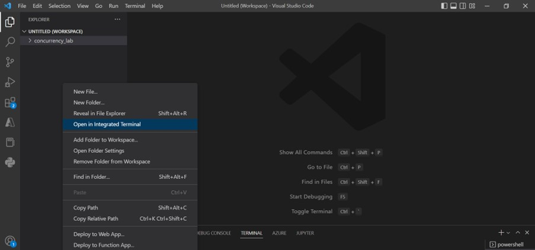
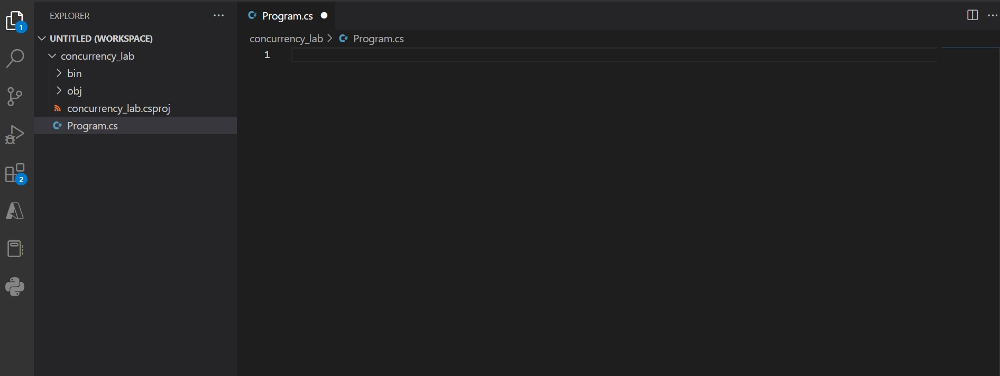
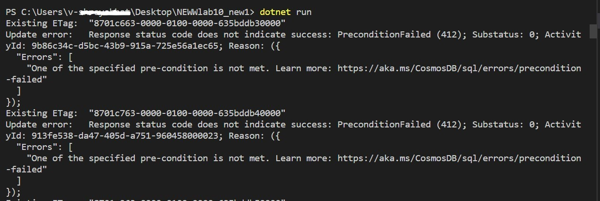

# Optimistic Concurrency Control

## Viewing the ETag Property of a Requested Resource

The SQL API supports optimistic concurrency control (OCC) through HTTP entity tags, or ETags. Every SQL API resource has an ETag, and the ETag is set on the server every time an item is updated. In this exercise, we will view the ETag property of a resource that is requested using the SDK.

### Recommended Prerequisites 

- [Transactions and optimistic concurrency control ](https://learn.microsoft.com/en-us/azure/cosmos-db/sql/database-transactions-optimistic-concurrency) 

### Create a .NET Core Project

1. Open **File explorer**, navigate to **_C:\Users\cosmosLabUser\Desktop_** location and create **concurrency_lab** folder that will be used to contain the content of your .NET Core project.
    
1. In the **concurrency_lab** folder, right-click the folder and select the **Open with Code** menu option.


1. In the Visual Studio Code window that appears, right-click the **Explorer** pane and select the **Open in integrated Terminal** menu option.

    

1. In the open terminal pane, enter and execute the following command:

    ```sh
    dotnet new console
    ```

    > This command will create a new .NET Core project. The project will be a **console** project and it creates Program.cs file.
    
    > You will see the below code in Program.cs and make sure you delete the existing below lines .
    
    ```sh
       //See https://aka.ms/new-console-template for more information 
       Console.WriteLine("Hello, World!"); 
    ```

1. Visual Studio Code will most likely prompt you to install various extensions related to **.NET Core** or **Azure Cosmos DB** development. None of these extensions are required to complete the labs.

1. In the terminal pane, enter and execute the following command:

    ```sh
    dotnet add package Microsoft.Azure.Cosmos --version 3.12.0
    ```

    > This command will add the [Microsoft.Azure.Cosmos](https://www.nuget.org/packages/Microsoft.Azure.Cosmos/) NuGet package as a project dependency. The lab instructions have been tested using the `3.12.0` version of this NuGet package.

1. Select the **Program.cs** link in the **Explorer** pane to open the file in the editor.

   

 1. Within the Program.cs editor tab, Add the following using blocks to the top of the editor:

    ```sh
      using System;
      using System.Collections.Generic;
      using System.Threading.Tasks;
      using Microsoft.Azure.Cosmos;
    ```
1. Within the Program class, add the following lines of code which creates variables for your connection information and Cosmos client. Database and Container info has to be added. Also **main()** method structure has to be added as given below.
   
   ```sh
    public class Program
   {
         private static readonly string _endpointUri = "<your uri>";
         private static readonly string _primaryKey = "<your key>";
         private static readonly string _databaseId = "NutritionDatabase";
         private static readonly string _containerId = "FoodCollection";
         private static CosmosClient _client = new CosmosClient(_endpointUri, _primaryKey);

    public static async Task Main(string[] args)
      {

      }
    }
    ```

1. For the `_endpointUri` variable, replace the placeholder value with the **URI** value and for the `_primaryKey` variable, replace the placeholder value with the **PRIMARY KEY** value from your Azure Cosmos DB account. Use [these instructions](https://github.com/CSALabsAutomation/azure-cosmosdb-lab/blob/main/steps/01_creating-a-partitioned-container/documentation.md) to get these values if you do not already have them:

   - For example, if your **uri** is `https://cosmosacct.documents.azure.com:443/`, your new variable assignment will look like this: 

    ```csharp
    private static readonly string _endpointUri = "https://cosmosacct.documents.azure.com:443/";
    ````

   - For example, if your **primary key** is `elzirrKCnXlacvh1CRAnQdYVbVLspmYHQyYrhx0PltHi8wn5lHVHFnd1Xm3ad5cn4TUcH4U0MSeHsVykkFPHpQ==`, your new variable assignment will look like this:

   ```csharp
   private static readonly string _primaryKey = "elzirrKCnXlacvh1CRAnQdYVbVLspmYHQyYrhx0PltHi8wn5lHVHFnd1Xm3ad5cn4TUcH4U0MSeHsVykkFPHpQ==";
   ```

1. Save all of your open editor tabs.

1. In the open terminal pane, enter and execute the following command:

   ```sh
   dotnet build
   ```

### Observe the ETag Property

1. Select the **Program.cs** link in the **Explorer** pane to open the file in the editor.

1. Locate the `Main()` method and add these lines:

   ```csharp
   public static async Task Main(string[] args)
    {
    using (CosmosClient client = new CosmosClient(_endpointUri, _primaryKey))
        {
        Database database = _client.GetDatabase(_databaseId);
        Container container = database.GetContainer(_containerId);
        }
    }
   ```
1. Add the following Code to Generate random Clientid and display 
 ```csharp
   int randomClientNum = (new Random()).Next(100, 1000);
   await Console.Out.WriteLineAsync($"Executing client with client id : "+randomClientNum);
 ```
 
1. Add the following code to asynchronously read a single item from the container, identified by its partition key and id inside the loop and show the current ETag value of the response item
   ```
   for (int i = 1; i <= 100; i++)
   {
    ItemResponse<Food> response = await container.ReadItemAsync<Food>("21083", new PartitionKey("Fast Foods"));
    await Console.Out.WriteLineAsync($"Existing ETag: {response.ETag}");
   }
   ```
    The ETag header and the current value are included in all response messages.


1. Next, add a new line of code to create an **ItemRequestOptions** instance that will use the **ETag** from the item and specify an **If-Match** header:

   ```csharp
   ItemRequestOptions requestOptions = new ItemRequestOptions { IfMatchEtag = response.ETag };
   ```

1. Add a new line of code to update a description and append randomClientNum and incremented i value of the retrieved item:

   ```csharp
    response.Resource.description = "Updated from  client : " + randomClientNum + "= " + i;
   ```

   > This line of code will modify a property of the description item. Here we are modifying the description collection property.

1. Add a new line of code inside try block to invoke the **UpsertItemAsync** method passing in both the item and the options:

   ```csharp
   
   try      {
                  response.Resource.description = "Updated from  client : " + randomClientNum + "= " + i;
                  response = await container.UpsertItemAsync(response.Resource, requestOptions: requestOptions);
                  await Console.Out.WriteLineAsync($"Description :\t{response.Resource.description}");
                  await Console.Out.WriteLineAsync($"New ETag:\t{response.ETag}");
            }
            catch (Exception ex)
            {
                await Console.Out.WriteLineAsync($"Update error:\t{ex.Message}");
            }
   ```

1. Your `Main` method should now look like this:
  ```csharp
   
  public static async Task Main(string[] args)
    {
        using (CosmosClient client = new CosmosClient(_endpointUri, _primaryKey))
        {
            var database = client.GetDatabase(_databaseId);
            var container = database.GetContainer(_containerId);
            int randomClientNum = (new Random()).Next(100, 1000);
            for (int i = 1; i <= 100; i++)
            {
                ItemResponse<Food> response = await container.ReadItemAsync<Food>("04002", new PartitionKey("Fats and Oils"));
                await Console.Out.WriteLineAsync($"Existing ETag:\t{response.ETag}");

          ItemRequestOptions requestOptions = new ItemRequestOptions { IfMatchEtag = response.ETag };
          try
            {
                  response.Resource.description = "Updated from  client : " + randomClientNum + "= " + i;
                  response = await container.UpsertItemAsync(response.Resource, requestOptions: requestOptions);
                  await Console.Out.WriteLineAsync($"Description :\t{response.Resource.description}");
                  await Console.Out.WriteLineAsync($"New ETag:\t{response.ETag}");
            }
            catch (Exception ex)
            {
                await Console.Out.WriteLineAsync($"Update error:\t{ex.Message}");
            }
           }
          }
        }
   ```

1. Save all of your open editor tabs.

1. At end of this point, your Program.cs file should look like this:

```csharp
using System;
using System.Collections.Generic;
using System.Threading.Tasks;
using Microsoft.Azure.Cosmos;

public class Program
{
    private static readonly string _endpointUri = "https://cosmosdb3rdcnrk.documents.azure.com:443/";
    private static readonly string _primaryKey = "SVpgeB8Wta4HopefFmUH9woIJaHAAItDs1kRiFLSyCBbHCwg9NRCew581gSnT82p3Kk1xwU6P3IHJ36lMzqI2Q==";
    private static readonly string _databaseId = "NutritionDatabase";
    private static readonly string _containerId = "FoodCollection";

    public static async Task Main(string[] args)
    {
        using (CosmosClient client = new CosmosClient(_endpointUri, _primaryKey))
        {
            var database = client.GetDatabase(_databaseId);
            var container = database.GetContainer(_containerId);
               int randomClientNum = (new Random()).Next(100, 1000);
          for (int i = 1; i <= 100; i++)
           {
                ItemResponse<Food> response = await container.ReadItemAsync<Food>("04002", new PartitionKey("Fats and Oils"));
                await Console.Out.WriteLineAsync($"Existing ETag:\t{response.ETag}");

            ItemRequestOptions requestOptions = new ItemRequestOptions { IfMatchEtag = response.ETag };
             try
               {
                     response.Resource.description = "Updated from  client : " + randomClientNum + "= " + i;
                     response = await container.UpsertItemAsync(response.Resource, requestOptions: requestOptions);
                     await Console.Out.WriteLineAsync($"Description :\t{response.Resource.description}");
                     await Console.Out.WriteLineAsync($"New ETag:\t{response.ETag}");
               }
               catch (Exception ex)
               {
                   await Console.Out.WriteLineAsync($"Update error:\t{ex.Message}");
               }
           }
         }
      }
   
}
```

22. Open 2 terminals, enter and execute the following command in both the terminals.

   ```sh
   dotnet run
   ```

23. Observe the output from the terminals.

   > You should see that the second update call fails because value of the ETag property has changed. The **ItemRequestOptions** class specifying the original ETag value as an If-Match header caused the server to decide to reject the update operation with an "HTTP 412 Precondition failure" response code.
   
  
