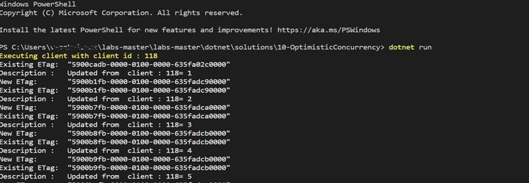

# Optimistic Concurrency Control
Optimistic concurrency control allows you to prevent lost updates and deletes. When two concurrent operations attempt to update the latest version of an item within a logical partition, one of them will win and the other will fail. This situation can be detected with the Optimistic Concurrency Control (OCC) before letting the two operations enter the transaction boundary inside the database engine. OCC protects your data from accidentally overwriting changes that were made by others. It also prevents others from accidentally overwriting your own changes

## Viewing the ETag Property of a Requested Resource

The SQL API supports optimistic concurrency control (OCC) through HTTP entity tags, or ETags. Every SQL API resource has an ETag, and the ETag is set on the server every time an item is updated. In this exercise, we will view the ETag property of a resource that is requested using the SDK and its use it for implementing OCC.

### Recommended Prerequisites 

- [Transactions and optimistic concurrency control ](https://learn.microsoft.com/en-us/azure/cosmos-db/sql/database-transactions-optimistic-concurrency) 

## Create Azure Cosmos DB Database and Container

You will now create a database and container within your Azure Cosmos DB account.

1. Navigate to the [Azure Portal](https://portal.azure.com)

1. On the left side of the portal, select the **Resource groups** link.

    

1. In the **Resource groups** blade, locate and select the **cosmoslabs** resource group.

    

1. In the **cosmoslabs** blade, select the **Azure Cosmos DB** account you recently created.

    

1. In the **Azure Cosmos DB** blade, locate and select the **Overview** link on the left side of the blade. At the top select the **Add Container** button.

    

1. In the **Add Container** popup, perform the following actions:

    1. In the **Database id** field, select the **Create new** option and enter the value **NutritionDatabase**.

    2. Do not check the **Provision database throughput** option.

        > Provisioning throughput for a database allows you to share the throughput among all the containers that belong to that database. Within an Azure Cosmos DB database, you can have a set of containers which shares the throughput as well as containers, which have dedicated throughput.

    3. In the **Container Id** field, enter the value **FoodCollection**.

    4. In the **Partition key** field, enter the value ``/foodGroup``.

    5. Select the **OK** button.
    
    6.Click on the item under food Collection Container.Then click on new item and copy paste the below item, click on save
   
    ```
                    {
                    "id": "024108",
                    "description": "Babyfood, dessert, peach cobbler, junior",
                    "tags": [
                        {
                            "name": "babyfood"
                        }        
                    ],
                    "version": 1,
                    "isFromSurvey": false,
                    "foodGroup": "Baby Foods",
                    "nutrients": [
                        {
                            "id": "291",
                            "description": "Fiber, total dietary",
                            "nutritionValue": 0.7,
                            "units": "g"
                        }
                    ],
                    "servings": [
                        {
                            "amount": 1,
                            "description": "jar Gerber Third Foods (6 oz)",
                            "weightInGrams": 170
                        }
                    ]

                }
    ```

Wait till the container, database and the item are created.

### Create a .NET Core Project

1. Open **File explorer**, navigate to **_C:\Users\cosmosLabUser\Desktop_** location and create **concurrency_lab** folder that will be used to contain the content of your .NET Core project.
    
1. In the Visual Studio Code , click on **File -> Open Folder** and select **concurrency_lab** folder.


1. In the Visual Studio Code window that appears, right-click the **Explorer** pane and select the **Open in integrated Terminal** menu option.

    

1. In the open terminal pane, enter and execute the following command:

    ```sh
    dotnet new console
    ```

    > This command will create a new .NET Core project. The project will be a **console** project and it creates Program.cs file.
    
    > You will see the below code in Program.cs and make sure you delete the existing below lines .
    
    ```sh
       //See https://aka.ms/new-console-template for more information 
       Console.WriteLine("Hello, World!"); 
    ```

1. Visual Studio Code will most likely prompt you to install various extensions related to **.NET Core** or **Azure Cosmos DB** development. None of these extensions are required to complete the labs.

1. In the terminal pane, enter and execute the following command:

    ```sh
    dotnet add package Microsoft.Azure.Cosmos --version 3.12.0
    ```

    > This command will add the [Microsoft.Azure.Cosmos](https://www.nuget.org/packages/Microsoft.Azure.Cosmos/) NuGet package as a project dependency. The lab instructions have been tested using the `3.12.0` version of this NuGet package.

1. Select the **Program.cs** link in the **Explorer** pane to open the file in the editor.

   

 1. Within the Program.cs editor tab, Add the following using blocks to the top of the editor:

    ```sh
      using System;
      using System.Collections.Generic;
      using System.Threading.Tasks;
      using Microsoft.Azure.Cosmos;
    ```
1. Within the Program class, add the following lines of code which creates variables for your connection information and Cosmos client. Database and Container info has to be added. Also **main()** method structure has to be added as given below.
   
   ```sh
   public class Program
   {
         private static readonly string _endpointUri = "<your uri>";
         private static readonly string _primaryKey = "<your key>";
         private static readonly string _databaseId = "NutritionDatabase";
         private static readonly string _containerId = "FoodCollection";
         private static CosmosClient _client = new CosmosClient(_endpointUri, _primaryKey);

    public static async Task Main(string[] args)
      {

      }
    }
    ```

1. For the `_endpointUri` variable, replace the placeholder value with the **URI** value and for the `_primaryKey` variable, replace the placeholder value with the **PRIMARY KEY** value from your Azure Cosmos DB account. Use [these instructions](https://github.com/CSALabsAutomation/azure-cosmosdb-lab/blob/main/steps/01_creating-a-partitioned-container/documentation.md) to get these values if you do not already have them:

   - For example, if your **uri** is `https://cosmosacct.documents.azure.com:443/`, your new variable assignment will look like this: 

    ```csharp
    private static readonly string _endpointUri = "https://cosmosacct.documents.azure.com:443/";
    ````

   - For example, if your **primary key** is `elzirrKCnXlacvh1CRAnQdYVbVLspmYHQyYrhx0PltHi8wn5lHVHFnd1Xm3ad5cn4TUcH4U0MSeHsVykkFPHpQ==`, your new variable assignment will look like this:

   ```csharp
   private static readonly string _primaryKey = "elzirrKCnXlacvh1CRAnQdYVbVLspmYHQyYrhx0PltHi8wn5lHVHFnd1Xm3ad5cn4TUcH4U0MSeHsVykkFPHpQ==";
   ```
1. Add these lines of code outside the program class

   ```csharp
       public class Tag
        {  
            public string name { get; set; }
        }

        public class Food
        {
            public string id { get; set; }
            public string description { get; set; }
            public List<Tag> tags { get; set; }
            public string foodGroup { get; set; }
        }
   ```
1. Save all of your open editor tabs.

1. In the open terminal pane, enter and execute the following command:

   ```sh
   dotnet build
   ```

### Implement Optimistic Concurrency Control(OCC) using the ETag Property

1. Select the **Program.cs** link in the **Explorer** pane to open the file in the editor.

1. Locate the `Main()` method and add these lines:

   ```csharp
           public static async Task Main(string[] args)
            {
            using (CosmosClient client = new CosmosClient(_endpointUri, _primaryKey))
                {
                Database database = _client.GetDatabase(_databaseId);
                Container container = database.GetContainer(_containerId);
                }
            }
   ```
1. Add the following Code to Generate random Clientid and display.

   ```csharp 
           int randomClientNum = (new Random()).Next(100, 1000);
           await Console.Out.WriteLineAsync($"Executing client with client id : "+randomClientNum);           
   ```
 
1. Add the following code to asynchronously read a single item from the container, identifying by its partition key and id inside the loop and show the current ETag value of the response item
   ```csharp
   for (int i = 1; i <= 100000; i++)
   {
    ItemResponse<Food> response = await container.ReadItemAsync<Food>("21083", new PartitionKey("Fast Foods"));
    await Console.Out.WriteLineAsync($"Existing ETag: {response.ETag}");
   }
   ```
    The ETag header and the current value are included in all response messages.


1. Next, add a new line of code to create an **ItemRequestOptions** instance that will use the **ETag** from the item and specify an **If-Match** header:

   ```csharp
   ItemRequestOptions requestOptions = new ItemRequestOptions { IfMatchEtag = response.ETag };
   ```
  
1. Add  these lines of code inside try block to invoke the **UpsertItemAsync** method passing in both the item and the options:

   ```csharp
   
   try     
   {
       response.Resource.description = "Updated from  client : " + randomClientNum + "= " + i;
       response = await container.UpsertItemAsync(response.Resource, requestOptions: requestOptions);
       await Console.Out.WriteLineAsync($"Description :\t{response.Resource.description}");
       await Console.Out.WriteLineAsync($"New ETag:\t{response.ETag}");
   }
   catch (Exception ex)
   {
       await Console.Out.WriteLineAsync($"Update error:\t{ex.Message}");
   }
   ```
   
     > The first line of code inside the try block will modify a property of the description.

1. Your `Main` method should now look like this:
     ```csharp

        public static async Task Main(string[] args)
            {
                using (CosmosClient client = new CosmosClient(_endpointUri, _primaryKey))
                {
                     var database = client.GetDatabase(_databaseId);
                     var container = database.GetContainer(_containerId);
                     int randomClientNum = (new Random()).Next(100, 1000);
                     Console.ForegroundColor = ConsoleColor.Yellow;
                     await Console.Out.WriteLineAsync($"Executing client with client id : "+randomClientNum);
                     Console.ForegroundColor=ConsoleColor.White;
                    for (int i = 1; i <= 100000; i++)
                    {
                        ItemResponse<Food> response = await container.ReadItemAsync<Food>("024108", new PartitionKey("Baby Foods"));
                        await Console.Out.WriteLineAsync($"Existing ETag:\t{response.ETag}");

                  ItemRequestOptions requestOptions = new ItemRequestOptions { IfMatchEtag = response.ETag };
                  try
                    {
                          response.Resource.description = "Updated from  client : " + randomClientNum + "= " + i;
                          response = await container.UpsertItemAsync(response.Resource, requestOptions: requestOptions);
                          await Console.Out.WriteLineAsync($"Description :\t{response.Resource.description}");
                          await Console.Out.WriteLineAsync($"New ETag:\t{response.ETag}");
                    }
                    catch (Exception ex)
                    {
                        await Console.Out.WriteLineAsync($"Update error:\t{ex.Message}");
                        break;
                    }
                   }
                  }
                }
      ```
1. Save all of your open editor tabs.

1. Now your Program.cs file should look like this:

 ```csharp
        using System;
        using System.Collections.Generic;
        using System.Threading.Tasks;
        using Microsoft.Azure.Cosmos;

        public class Program
        {
            private static readonly string _endpointUri = "<your uri>";
            private static readonly string _primaryKey = "<your key>";
            private static readonly string _databaseId = "NutritionDatabase";
            private static readonly string _containerId = "FoodCollection";

                public static async Task Main(string[] args)
                {
                    using (CosmosClient client = new CosmosClient(_endpointUri, _primaryKey))
                    {
                        var database = client.GetDatabase(_databaseId);
                        var container = database.GetContainer(_containerId);
                        int randomClientNum = (new Random()).Next(100, 1000);
                        Console.ForegroundColor = ConsoleColor.Yellow;
                        await Console.Out.WriteLineAsync($"Executing client with client id : "+randomClientNum);
                        Console.ForegroundColor=ConsoleColor.White;
                        for (int i = 1; i <= 1000000; i++)
                        {
                            ItemResponse<Food> response = await container.ReadItemAsync<Food>("024108", new PartitionKey("Baby Foods"));
                            await Console.Out.WriteLineAsync($"Existing ETag:\t{response.ETag}");

                        ItemRequestOptions requestOptions = new ItemRequestOptions { IfMatchEtag = response.ETag };
                      try
                        {
                              response.Resource.description = "Updated from  client : " + randomClientNum + "= " + i;
                              response = await container.UpsertItemAsync(response.Resource, requestOptions: requestOptions);
                              await Console.Out.WriteLineAsync($"Description :\t{response.Resource.description}");
                              await Console.Out.WriteLineAsync($"New ETag:\t{response.ETag}");
                        }
                        catch (Exception ex)
                        {
                            await Console.Out.WriteLineAsync($"Update error:\t{ex.Message}");
                            break;
                        }
                            }
                        }
                    }  
         }
            public class Tag
            {  
                public string name { get; set; }
            }

            public class Food
            {
                public string id { get; set; }
                public string description { get; set; }
                public List<Tag> tags { get; set; }
                public string foodGroup { get; set; }
            }
 ```

1. Open 2 terminals, go to the program location and enter and execute the following command in both the terminals.
   

   ```sh
   dotnet run
   ```
   
   Two instances of the program will try to update item with id "04002" concurrently. 

1. Observe the output from 2 the terminals.
  
  After a while, you should see that the second program execution failing because ETag property was changed by an update performed from the first program execution simultaneously. If-Match header on ETag causes the server to reject the concurrent update operation with an "HTTP 412 Precondition failure" response code, preventing loss of update made by the first instance.  
   
  #### Output from terminal 1
    
  '
     
  #### Output from terminal 2
    
  
    
  
